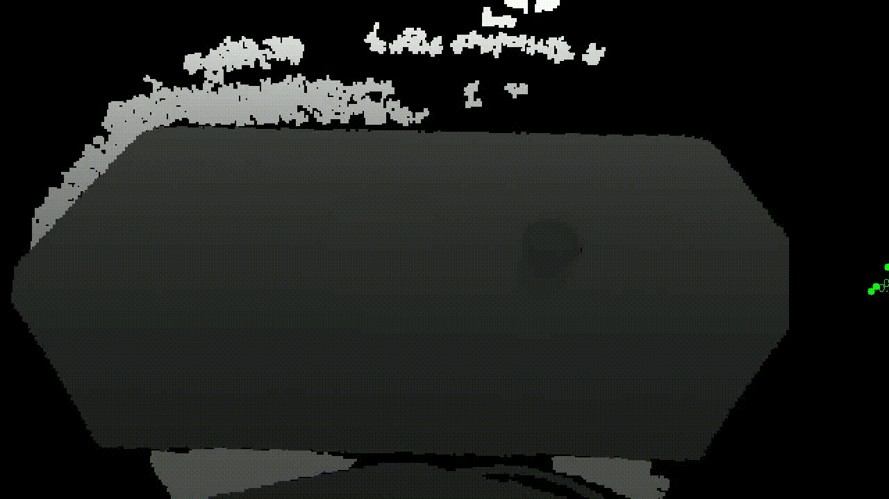
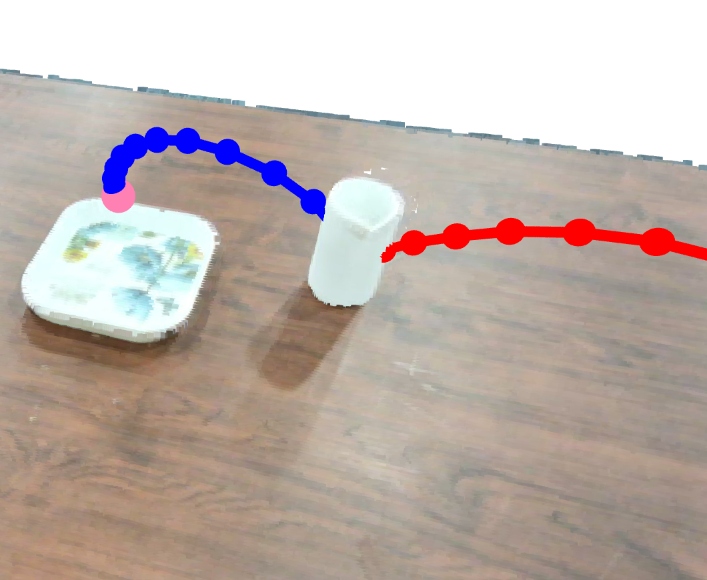
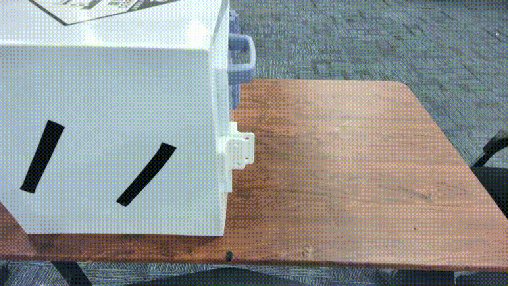
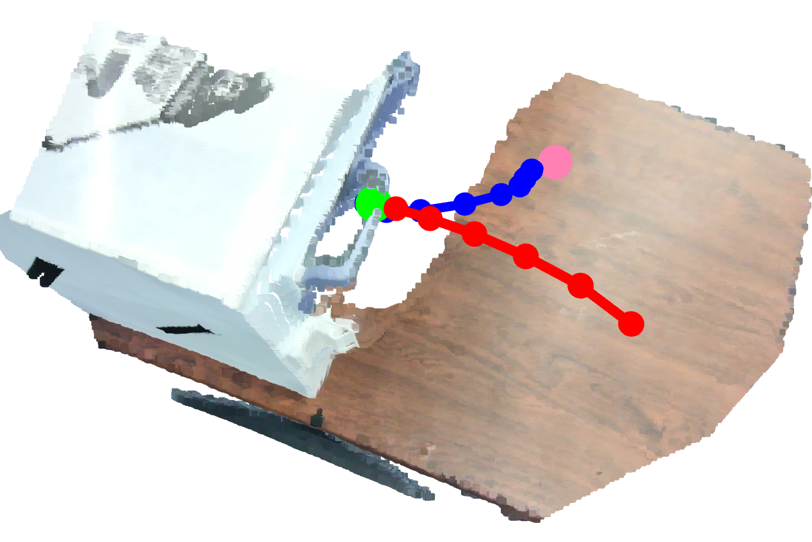
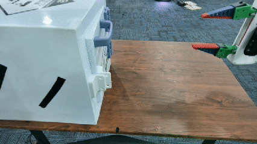
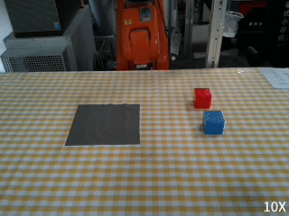

# [T-PAMI'26] Uni-Hand: Universal Hand Motion Forecasting in Egocentric Views

[Junyi Ma](https://github.com/BIT-MJY)<sup>1</sup>, [Wentao Bao](https://cogito2012.github.io/homepage/)<sup>2</sup>, [Jingyi Xu](https://github.com/BIT-XJY)<sup>1</sup>, [Guanzhong Sun](https://github.com)<sup>3</sup>, [Yu Zheng](https://scholar.google.com/citations?user=M4cXM9kAAAAJ&hl=zh-CN)<sup>1</sup>, [Erhang Zhang](https://scholar.google.com/citations?user=j1mUqHEAAAAJ&hl=en)<sup>1</sup>, [Xieyuanli Chen](https://scholar.google.com/citations?user=DvrngV4AAAAJ&hl=zh-CN)<sup>4</sup>, [Hesheng Wang](https://scholar.google.com/citations?hl=en&user=q6AY9XsAAAAJ)<sup>1*</sup>

<sup>1</sup> Shanghai Jiao Tong University  
<sup>2</sup> Meta Reality Labs  
<sup>3</sup> China University of Mining and Technology  
<sup>4</sup> National University of Defense Technology

[[`Paper`](https://arxiv.org/pdf/2511.12878)][[`Project Page`](https://irmvlab.github.io/unihand.github.io/)][[`Code`](https://github.com/IRMVLab/UniHand)][[`Preliminary Version`](https://arxiv.org/pdf/2504.07375)]

**Human Videos are All You Need!**

**In this repository, we demonstrate how to train Uni-Hand using only human demonstration videos and leverage the trained model to generate end-effector trajectories for robotic manipulation.** To evaluate our method on other public datasets (e.g., EgoPAT3D), please refer to our [preliminary work](https://github.com/IRMVLab/MMTwin).

> If any bugs are spotted or any download links are broken, please do not hesitate to make a PR or open an issue. We would be glad if Uni-Hand could be useful as a codebase for your own research and development.

<a id="news"></a>

## 📣 News

- **[2026-05]** Add [V-JEPA 2](https://github.com/facebookresearch/vjepa2) support to Uni-Hand.
- **[2026-05]** Uni-Hand is accepted by [T-PAMI](https://ieeexplore.ieee.org/document/11517265)! 🎉
- **[2026-03]** Add [a DiT-based trajectory diffusion variant](https://github.com/IRMVLab/UniHand/tree/baselines/DiT-version) for Uni-Hand.
- **[2026-03]** Release Uni-Hand's depth input from [Depth Anything 3](https://github.com/ByteDance-Seed/Depth-Anything-3).
- **[2026-02]** Add [SAM-3D-Body](https://github.com/facebookresearch/sam-3d-body) support to Uni-Hand.
- **[2025-12]** Release the initial version of Uni-Hand.


<a id="contents"></a>

## 📚 Contents

- [Install Uni-Hand](#install-uni-hand)
  - [Prepare a conda environment](#prepare-a-conda-environment)
  - [Clone HaMeR/SAM-3D-Body and DINOv2/V-JEPA 2 (optional)](#clone-hamersam-3d-body-and-dinov2v-jepa-2-optional)
- [Prepare Human Video Data](#prepare-human-video-data)
  - [Recommended data structure](#recommended-data-structure)
  - [Extract and refine 3D hand trajectories](#extract-and-refine-3d-hand-trajectories)
  - [Label hand-object contact and separation timestamps](#label-hand-object-contact-and-separation-timestamps)
  - [Extract vision features](#extract-vision-features)
- [Run Uni-Hand](#run-uni-hand)
  - [Train and evaluate](#train-and-evaluate)
  - [Visualize predicted end-effector trajectories](#visualize-predicted-end-effector-trajectories)
- [Download Human Videos and Pretrained Models](#download-human-videos-and-pretrained-models)
- [Deploy on Your Own Robot](#deploy-on-your-own-robot)
- [Cite Our Work](#cite-our-work)
- [License](#license)

<a id="install-uni-hand"></a>

## 🛠️ Install Uni-Hand

<a id="prepare-a-conda-environment"></a>

### Prepare a conda environment

First, clone Uni-Hand:

```bash
git clone https://github.com/IRMVLab/UniHand
cd UniHand
```

Create and activate a new conda environment:

```bash
conda create -n unihand python=3.10
conda activate unihand
```

Install dependencies:

```bash
pip install -r requirements.txt
```

<a id="clone-hamersam-3d-body-and-dinov2v-jepa-2-optional"></a>

### Clone HaMeR/SAM-3D-Body and DINOv2/V-JEPA 2 (optional)

Since we use HaMeR for hand motion extraction and DINOv2 for vision feature extraction, we need to clone them in this project. We also recommend using [SAM-3D-Body](https://github.com/facebookresearch/sam-3d-body) and [V-JEPA 2](https://github.com/facebookresearch/vjepa2).

```bash
git clone https://github.com/geopavlakos/hamer.git
# install HaMeR following its instruction
# replace hamer/datasets/vitdet_dataset.py with preprocess_human_video/vitdet_dataset.py in our repo

# Optional
git clone https://github.com/facebookresearch/sam-3d-body.git
# install sam-3d-body following its instruction
# replace sam-3d-body/sam_3d_body_estimator.py with preprocess_human_video/sam_3d_body_estimator.py in our repo

git clone https://github.com/facebookresearch/dinov2.git
# install DINOv2 following its instruction
# Model: facebook/dinov2-base

# Optional
git clone https://github.com/facebookresearch/vjepa2.git
# install V-JEPA 2 following its instruction
# Model: ./weights/vitg-384.pt
```

- ⚡ Alternatively, you can directly download our preprocessed data (hand trajectories + vision features) for our toy dataset [here](https://pan.sjtu.edu.cn/web/share/8b4eff7f7b20ce1d8630b6ee70d357e2).
- Uni-Hand supports vision features generated by any other visual foundation models. Please update the `input_dims` of `glip_encoder` in [model.yaml](unihand/configs/model.yaml) if the feature vector dimension is different from DINOv2's. In this repo, we have released pretrained models with DINOv2 and V-JEPA 2.

<a id="prepare-human-video-data"></a>

## 🎥 Prepare Human Video Data

<a id="recommended-data-structure"></a>

### Recommended data structure

```text
./UniHand
    |-- human_video_data
        |-- 2025-0723-07-17-46
        |-- 2025-0723-07-17-52
        |-- 2025-0723-07-17-59
            |-- depth
                |-- 000000.npy
                |-- 000001.npy
                |-- ...
            |-- rgb
                |-- 000000.npy
                |-- 000001.npy
                |-- ...
            |-- 2025-0723-07-17-59_point_cloud.ply
    |-- hand_keypoints
    |-- hand_trajs
    |-- vision_features
```

- We have provided the toy dataset (100 human pick-and-place videos) [here](https://pan.sjtu.edu.cn/web/share/d707f6b604a1922edfd269337f527f96), which was recorded by a RealSense LiDAR Camera L515. We plan to release more human manipulation videos in the future.
- The `.ply` file will be generated by the following scripts automatically.
- You can collect your own dataset with one RGBD camera following the data structure. **Just sit in front of your robot and hit record—it's that easy!**


<a id="extract-and-refine-3d-hand-trajectories"></a>

### Extract and refine 3D hand trajectories

First, we extract raw 3D hand trajectories from human videos, with the help of HaMeR or SAM-3D-Body.

```bash
# with HaMeR
cp preprocess_human_video/extract_hand_keypoints_hamer.py ./hamer
cd hamer
python extract_hand_keypoints_hamer.py \
    --img_folder ../human_video_data \
    --out_folder ../hand_keypoints 

# or using SAM-3D-Body
cp preprocess_human_video/extract_hand_keypoints_sam3d_body.py ./sam-3d-body
cd sam-3d-body
python extract_hand_keypoints_sam3d_body.py \
    --img_folder ../human_video_data \
    --out_folder ../hand_keypoints_sam3d_crop \
    --sam3d_checkpoint ../sam-3d-body/checkpoints/sam-3d-body-dinov3/model.ckpt \
    --sam3d_mhr_path ../sam-3d-body/checkpoints/sam-3d-body-dinov3/assets/mhr_model.pt \
    --draw_on_crop \
    --save_bbox \
    --seq_order name \
    --draw_on_full

# extract trajs
cd ../preprocess_human_video
python generate_hand_trajs.py \
    --input_root ../human_video_data \
    --keypoint_root ../hand_keypoints \
    --output_root ../hand_trajs
```



The point cloud files have been generated automatically. Then, we clean the hand trajectories for better training performance:

```bash
python clean_hand_data.py \
    --gt_paths ../hand_trajs \
    --joint_idx 0
```

You can indicate the joint index you want to visualize.

⚡ Alternatively, you can directly use our preprocessed hand motion data [here](https://pan.sjtu.edu.cn/web/share/0df6c91c1b6a14fcd292b63fd42c82b3).

<a id="label-hand-object-contact-and-separation-timestamps"></a>

### Label hand-object contact and separation timestamps

- Contact/separation timestamps are crucial for training Uni-Hand, since trajectory data alone is insufficient to generate the gripper’s grasping actions. Please refer to [our paper](https://arxiv.org/pdf/2511.12878) for more details.
- ⚡ We have provided the [contact/separation labels](https://pan.sjtu.edu.cn/web/share/9421c56ce687119ad67c14af6fc58aa6) of the toy dataset under the `unihand/data_utils` folder. You can manually label the timings of your own videos and organize them as `date_folders.csv`.
- You can also try our recent work, [EgoLoc](https://github.com/IRMVLab/EgoLoc), for autonomous temporal interaction localization.

<a id="extract-vision-features"></a>

### Extract vision features

Here we use DINOv2 to extract vision features, while you can also replace it with any other visual foundation models.

```bash
cp preprocess_human_video/extract_visual_features_dinov2.py ./dinov2
cd dinov2
python extract_visual_features_dinov2.py \
    --input_root ../human_video_data  \
    --output_root ../vision_features \
    --interval 1
```

We also provide the script for V-JEPA 2 feature extraction. Please set `input_dims` of `glip_encoder` in [model.yaml](unihand/configs/model.yaml) to `1408`.

```bash
cp preprocess_human_video/extract_visual_features_vjepa2.py ./vjepa2
cd vjepa2
python extract_visual_features_vjepa2.py \
    --input_root ../human_video_data  \
    --output_root ../vision_features \
    --interval 1
```

⚡ Alternatively, you can directly use our pre-extracted features: [DINOv2](https://pan.sjtu.edu.cn/web/share/74fe967c6b61806c5c529aa747dcaeb6), [V-JEPA 2](https://pan.sjtu.edu.cn/web/share/6664e38668b27b2067cdc27a2189f6ef) for quick reproduction.


<a id="run-uni-hand"></a>

## 🚀 Run Uni-Hand

<a id="train-and-evaluate"></a>

### Train and evaluate

To train Uni-Hand, set `evaluate` to `false` in `unihand/configs/traineval.yaml`, and run:

```bash
cd unihand
bash run_unihand.sh
```

- After training, you can evaluate the trained model by setting `evaluate` to `true` in `unihand/configs/traineval.yaml` and run the same command. You can set `gap` to `1` for better results.
- You can resume training from or evaluate a checkpoint by setting `resume` in `unihand/configs/traineval.yaml`. If you evaluate your model trained from scratch, set `use_os_weights` to `false` and set `resume` to a non-existent path.
- ⚡ We provide the pretrained model of Uni-Hand [here](https://pan.sjtu.edu.cn/web/share/4cfa8b4fe54b4187c393135cb8562fd7). Please set `use_os_weights` to `true` and test it.
- Uni-Hand is robust to background variations thanks to the use of depth information.

<a id="visualize-predicted-end-effector-trajectories"></a>

### Visualize predicted end-effector trajectories

After evaluation, you can visualize end-effector trajectories. As in this demo, we predict hand wrist trajectories for robotic manipulation, and a heuristic grasp offset is used to convert the predicted wrist waypoints to end-effector trajectories.

```bash
cd unihand
python viz_predicted_trajs.py
```

⚡ We have provided the predicted trajectories for the toy dataset [here](unihand/collected_pred).

<p float="left">
  
  
</p>

<p float="left">
  
  
</p>

<a id="download-human-videos-and-pretrained-models"></a>

## 📦 Download Human Videos and Pretrained Models

### Datasets

| Task | Content | Download Link |
|------|---------|------|
| Pick-and-Place | Human videos with annotations | [Download](https://pan.sjtu.edu.cn/web/share/8b4eff7f7b20ce1d8630b6ee70d357e2) |
| Open-Door | Human videos with annotations | [Download](https://pan.sjtu.edu.cn/web/share/0a1b2d35240b75ac8db6064ea32304e8) |
| Pick-and-Place | Depth estimated by DA3 | [Download](https://pan.sjtu.edu.cn/web/share/ca56dcf8ab86422dd5258a89d18cdbfd) |
| Open-Door | Depth estimated by DA3 | [Download](https://pan.sjtu.edu.cn/web/share/ca56dcf8ab86422dd5258a89d18cdbfd) |

### Uni-Hand Pretrained Checkpoints

| Task | Hand Det. | Vision Feat. | Download Link |
|------|-----------|--------------|------|
| Pick-and-Place | HaMeR | DINOv2 | [Checkpoint](https://pan.sjtu.edu.cn/web/share/4cfa8b4fe54b4187c393135cb8562fd7) |
| Pick-and-Place | HaMeR | V-JEPA 2 | [Checkpoint](https://pan.sjtu.edu.cn/web/share/68438110181c600fb94d3de3794ef813) |
| Pick-and-Place | SAM-3D-Body | DINOv2 | [Checkpoint](https://pan.sjtu.edu.cn/web/share/600ac65b171b03f853fd3eb55b8a1622) |
| Open-Door | HaMeR | DINOv2 | [Checkpoint](https://pan.sjtu.edu.cn/web/share/b409876b22d5d6edf78ca6bb42e9229b) |
| Open-Door | HaMeR | V-JEPA 2 | [Checkpoint](https://pan.sjtu.edu.cn/web/share/7ae5d911ee93b1e7fe5e3710c0c5417f) |
| Open-Door | SAM-3D-Body | DINOv2 | [Checkpoint](https://pan.sjtu.edu.cn/web/share/5302ff69cc0c4797ef9c66a1c68b1c1f) |

- We have put the [train](https://pan.sjtu.edu.cn/web/share/3ae909c9dfb865f04b11973dedf766e0)/[test](https://pan.sjtu.edu.cn/web/share/e0d87213cca8db3f5c398e3098780016) splits and [contact/separation labels](https://pan.sjtu.edu.cn/web/share/9421c56ce687119ad67c14af6fc58aa6) of the pick-and-place task under the `unihand/data_utils` folder. For the open-door task, please refer to this [link](https://pan.sjtu.edu.cn/web/share/0a1b2d35240b75ac8db6064ea32304e8).
- We empirically found that SAM-3D-Body produces jittered trajectory labels with its hand branch in our cases, leading to worse predictions. We are figuring out a smooth mechanism to deal with this issue.
- The pseudo depth estimated by [Depth Anything 3](https://github.com/ByteDance-Seed/Depth-Anything-3) is also provided. Feel free to use it as alternative depth input of Uni-Hand.
- We sincerely appreciate [Yutong Dong](https://github.com/venicerae) for debugging Uni-Hand and developing the SAM-3D-Body version.
- We would also like to thank [Yunji Feng](https://blog.fengyunji.site/) for his efforts in developing a DiT-based trajectory diffusion variant for Uni-Hand. Please refer to [this branch](https://github.com/IRMVLab/UniHand/tree/baselines/DiT-version) for more details.


<a id="deploy-on-your-own-robot"></a>

## 🤖 Deploy on Your Own Robot 

We have demonstrated the deployment of Uni-Hand on real robots. Please refer to our [project page](https://irmvlab.github.io/unihand.github.io/) and [paper](https://arxiv.org/abs/2511.12878) for more details.

<div style="display:flex; justify-content:space-between; width:100%;">
  
  
</div>

<div style="display:flex; justify-content:space-between; width:100%;">
  
  
</div>

**Let your robot’s end-effector follow the trajectories predicted by Uni-Hand!** :robot:

This is the initial version of Uni-Hand, which has already provided an out-of-the-box paradigm for human-video-based imitation learning. We will provide a more comprehensive version with multimodal inputs and additional downstream tasks, and relax the heuristic grasp assumption in four months.

<a id="cite-our-work"></a>

## 🙏🏻 Cite Our Work

If you find our work helpful to your research, we would appreciate it if you could cite our paper:

```bibtex
@article{ma2026unihand,
    title={Uni-Hand: Universal Hand Motion Forecasting in Egocentric Views},
    author={Junyi Ma and Wentao Bao and Jingyi Xu and Guanzhong Sun and Yu Zheng and Erhang Zhang and Xieyuanli Chen and Hesheng Wang},
    journal={IEEE Transactions on Pattern Analysis and Machine Intelligence},
    year={2026},
}
```

```bibtex
@INPROCEEDINGS{ma2025mmtwin,
    author={Ma, Junyi and Bao, Wentao and Xu, Jingyi and Sun, Guanzhong and Chen, Xieyuanli and Wang, Hesheng},
    booktitle={2025 IEEE/RSJ International Conference on Intelligent Robots and Systems (IROS)},
    title={Novel Diffusion Models for Multimodal 3D Hand Trajectory Prediction},
    year={2025},
    pages={2408-2415},
    doi={10.1109/IROS60139.2025.11246803}}
```

```bibtex
@article{ma2025madiff,
    title={MADiff: Motion-Aware Mamba Diffusion Models for Hand Trajectory Prediction on Egocentric Videos},
    author={Junyi Ma and Xieyuanli Chen and Wentao Bao and Jingyi Xu and Hesheng Wang},
    journal={IEEE Transactions on Pattern Analysis and Machine Intelligence},
    year={2025},
}
```

<a id="license"></a>

## 📄 License

This project is free software made available under the MIT License. For details see the LICENSE file.